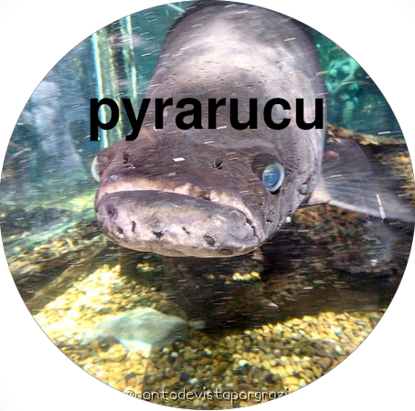

# Pyrarucu



Pyrarucu é um bot de Xadrez desenvolvido pelo grupo de extensão em Ciência de Dados da USP São Carlos, DATA. É desenvolvido em Python, pela facilidade de integração com a interface do lichess-bot e de compreensão.

Visamos, com esse projeto, aplicar técnicas de Inteligência Artifical em conjunto com o Aprendizado de Máquina priorizando a legibilidade e inteligibilidade.

Esse projeto é uma continuação do [Tiny Chess Bot Challenge](https://github.com/icmc-data/tiny-chess-bots).

Sinta-se livre para abrir uma nova Issue (novas funcionalidades e melhorias para o Bot) e fazer seu Pull Request com adições ao projeto quando possível. Caso seja membro do DATA e queira contribuir, converse com um coordenador para ser adicionado como contribuidor.

## Instalação
Clone o repositório e rode a seguinte lista de comandos
``` 
python -m venv venv
source venv/bin/activate
pip install -r requirements
```
Isso irá criar um ambiente virtual em Python, permitindo o desenvolvimento do bot.

## Jogando localmente
Para jogar localmente contra o bot, use 
``` 
python play.py
```
Assim, é possível ter uma noção do tempo de jogo e força do Pyrarucu.
É possível sair do jogo com `Ctrl+D`

## Como criar um bot?
Mais informações sobre o funcionamento do bot podem ser encontradas em [Pyrarucu.md](Pyrarucu.md)

## Authors
- [@vitorfrois](https://www.github.com/vitorfrois)
- [@MurilloMMartins](https://www.github.com/MurilloMMartins)

## Referências
[Chess Programming Wiki](https://www.chessprogramming.org/Main_Page)
[Stanford CS221](https://stanford.edu/~cpiech/cs221/apps/deepBlue.html)
[Coding Adventure: Making a Better Chess Bot](https://www.youtube.com/watch?v=_vqlIPDR2TU)
Teste
