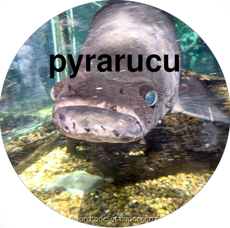

# Pyrarucu



Chess bot developed by University of São Paulo DATA Extension Group. 
You still cannot challenge the bot at [Lichess](https://lichess.org/nolinkyet).

This bot is a continuation of the work developed for the [Tiny Chess Bot Challenge](https://github.com/icmc-data/tiny-chess-bots).


## Installation
Clone the repository and run this list of commands
```
python -m venv venv
source venv/bin/activate
pip install -r requirements
```

## Code 
The brain of the bot is being coded within the [strategies.py](strategies.py) `MyBot()` function.

## Playing and Testing
If you want to test your chess abilities against the bot, you can run the following command at the dir.
```
python play.py
```
Exit the game anytime by pressing `Ctrl+D`


## Authors
- [@vitorfrois](https://www.github.com/vitorfrois)
- [@MurilloMMartins](https://www.github.com/MurilloMMartins)


## Features
- Alpha Beta Pruning
- Simple Evaluation Function
